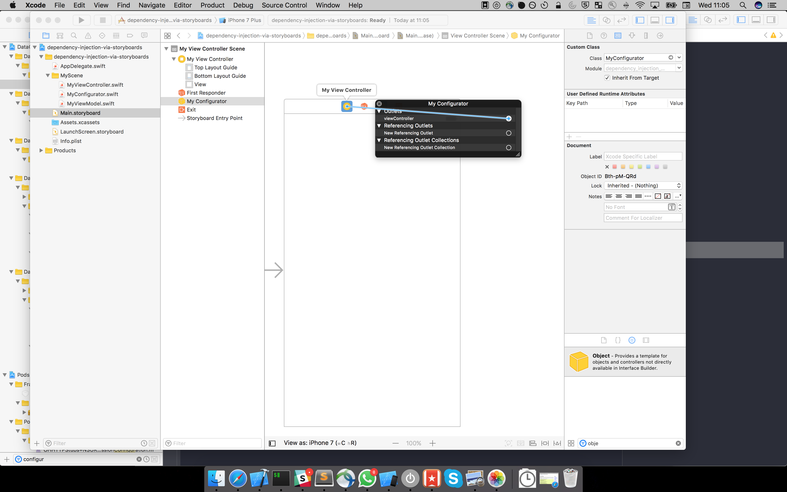

# Dependency Injection via Storyboards
A solution to inject dependencies into ViewControllers created from Storyboards

Create a subclass of NSObject (I called it a Configurator) in the same storyboard Scene as your 
View Controller, and add an IBOutlet connecting your Configurator to your View Controller.

Then in the Configurator's `awakeFromNib` function, inject the dependencies on your View Controller.
